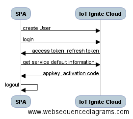

# Sequence Diagram



# REST APIs
The REST API url for the requests;
```
const API_URL = 'https://api.ardich.com/api/v3';
```
## Create User
Creating user to Service Provider Brand is as follows;
```
$http({
  method: 'POST',
  data:{
     "firstName": firstName,
     "lastName": lastName,
     "mail": mail,
     "password": password,
     "profileName": profileName,
     "brand": brand
    },
  url: API_URL + '/public/create-restricted-user',
  headers: {
      'Content-Type': 'application/json'
  },
})
```
## Login
```
$http({
  method: 'POST',
  data: "grant_type=password&username=" + email + "&password=" + password;,
  url: API_URL + '/login/oauth',
  headers : {
     'Content-Type': 'application/x-www-form-urlencoded',
     'Authorization': 'Basic ' + btoa(clientId + ":")
  }
})
```
`clientId` is Service Provider Id that was created in IoT-Ignite Devzone.

The return access token, refresh token and user email could be stored in the SQLite table for future use as in sample code.
## Device
### Get Information
Mostly for the interaction of the user interface there are success and error callbacks used in functions. 

* Get Service Default Information
```
$http({
  method: 'GET',
  headers: {
    'Authorization': 'Bearer ' + accessToken
  },
  url: API_URL + '/ignite/default-qr-attributes'
})
```

### Update Information
You can change device label in IoT Ignite Cloud as follows:
```
$http({
  method: 'PUT',
  data:{
      "label": label
     },
  headers: {
    'Authorization': 'Bearer ' + accessToken
  },
  url: API_URL + '/device/' + deviceCode + '/label'
})
```
You can also inform device itself about label change:
```
$http({
  method: 'POST',
  data:{},
  headers: {
    'Authorization': 'Bearer ' + accessToken
  },
  url: API_URL + '/device/' + deviceCode + '/control/pushTenantDeviceInfo'
})
```
For full information about IoT Ignite Cloud APIs, please visit [devzone.iot-ignite.com/article-categories/api/](https://devzone.iot-ignite.com/article-categories/api/)
