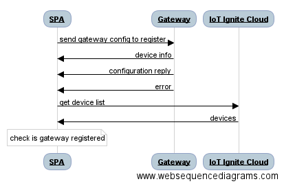

# Sequence Diagram



# Discover
To discover Ignite getaways nearby, list the Wifi SSIDs and search `IGNITE_GATEWAY` prefix. Note that unregistered gateways wait for connection in Wifi hotspot mode.

```
var filter = "IGNITE_GATEWAY";
NetworkService.listWifi(function(wifi){
    var igniteWifiArray = NetworkService.filterWifi(wifi, filter);
}
```
# Register
When you find a gateway, it is time to register it to your IoT-Ignite Platform. Connect to that gateway with the help of the `WifiWizard` plugin handled in `Network Service`. After connecting to that gateway, send configuration to it via websocket.

`$q` is a service that helps you run functions asynchronously, and use their return values (or exceptions) when they have completed their processing. For more information about that please visit [https://docs.angularjs.org/api/ng/service/$q](https://docs.angularjs.org/api/ng/service/$q)

`gatewayConfig` contains information about Internet connection and service provider so that gateway could be used as a IoT-Ignite Gateway.

```
var gatewayConfig = {"type" : "CONFIGURATION", "params":{"ssid": ssid,"ssidPassword":pass,"appKey":success.data.appKey, "activationCode" : success.data.activationCode, "profileName" : profile, "previousIp" : clientIp, "logPort" : 12734}}
```
```
function sendGatewayConfig(timeout, gatewayIp, gatewayConfig, logFunc) {
var deferred = $q.defer();

  try {
    var ws = new WebSocket("ws://" + gatewayIp + ":12732");
    var configurationReplyMsg = false;
    var deviceInfoMsg = false;
    var deviceInfo = "";
    ws.onopen = function() {
      console.log("Sending configuration " + JSON.stringify(gatewayConfig));
      ws.send(JSON.stringify(gatewayConfig));
      logFunc("success", "Successfully connected to Gateway Socket ", 2000);
    };
    ws.onmessage = function(evt){
      console.log("Message received: " + evt.data);
      var message = JSON.parse(evt.data);
      if(message.type == "DEVICE_INFO"){
        deviceInfo = message;
        deviceInfoMsg = true;
      } else if(message.type == "CONFIGURATION_REPLY" && message.params.result == "SUCCESS"){
        configurationReplyMsg = true;
      } else {
        deferred.reject("Reject error: " + JSON.stringify(message));
        ws.close();
      }
      if(deviceInfoMsg && configurationReplyMsg){
        deferred.resolve(deviceInfo);
        ws.close();
      }
    }
    ws.onerror = function(exception){
      console.log("Could not connect to : " + gatewayIp);
      deferred.reject("Could not connect to : " + gatewayIp);
      ws.close();
    }
  } catch(exception) {
    console.log("Error: " + exception);
    deferred.reject("Reject error: " + exception);
    ws.close();
  }
setTimeout(function () {
  deferred.reject("Send gateway config timeout");
}, timeout);

return deferred.promise;
}
```
After configuration is sent successfully, it is time to check that this gateway is registered to Service Provider's IoT-Ignite Platform. To get registered device list, device summary must be requested from IoT Ignite cloud.
```
$http({
  method: 'GET',
  headers: {
    'Authorization': 'Bearer ' + accessToken
  },
  url: API_URL + '/device/summary?page=0&size=100'
})
```

