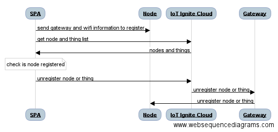

# Sequence Diagram



# Discover
To discover Ignite nodes nearby, list the Wifi ssids and filter the ones with the `IotIgnite` prefix. Note that unregistered nodes wait for connections in Wifi hotspot mode as gateways do.
```
var filter = "IotIgnite";
NetworkService.listWifi(function(wifi){
    var igniteWifiArray = NetworkService.filterWifi(wifi, filter);
}
```
# Register
After selecting registered gateway from your service nearby, it is time to register node(s).

Get Device Details
```
$http({
  method: 'GET',
  headers: {
    'Authorization': 'Bearer ' + accessToken
  },
  url: API_URL + '/device/' + deviceCode
})
```
Connect to that node with the help of the `WifiWizard` plugin handled in `Network Service`

After connecting to node, send configuration that contains its identifier, gateway id and internet connection information(ssid, password) to it via HTTP post request.
```
var configurations = "node-configurations=" + '{"node-configurations":{"nodeId":"' + nodeId + '","gatewayId":"' + gatewayId + '","ssid":"' + ssid + '","password":"' + pass + '"}}';

$http({
 method: 'POST',
 data: configurations,
 headers: {
   'Content-Type' : 'application/x-www-form-urlencoded;'
 },
 url: "http://192.168.4.1/node-configurations"
});
```
After configuration is sent successfully, it is time to check that this node is registered to Service Provider's IoT-Ignite Platform. This could be done via IoT Ignite cloud REST API.
```
$http({
 method: 'GET',
 headers: {
   'Authorization': 'Bearer ' + accessToken
 },
 url: API_URL + '/device/' + deviceId + "/device-node-inventory"
});
```
# Unregister
Registered node and things can be unregistered as follows;
```
$http({
 method: 'POST',
 data:{
   "params": [
      {
        "nodeId": nodeId,
        "sensorId": thingId
      }
    ]
 },
 headers: {
   'Authorization': 'Bearer ' + accessToken
 },
 url: API_URL + '/device/' + deviceId + '/control/unregister-node-thing'
});
```

